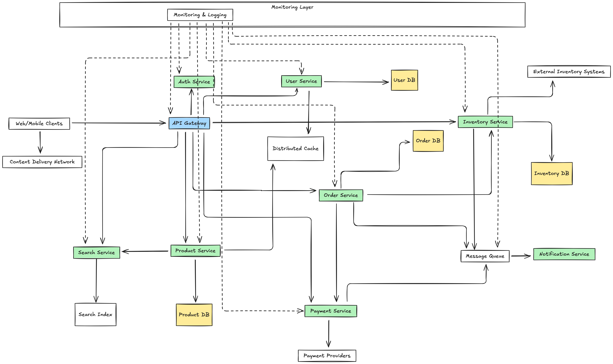

# XYZ Marketplace Architecture - Part 1

## Architecture Overview

Our online marketplace architecture is designed for scalability, reliability, and performance. The system follows a microservices pattern with clear separation of concerns between components.

### Client Layer

- **Web/Mobile Clients**: Front-end applications that users interact with
- **CDN**: Delivers static content efficiently to reduce load and improve performance

### API Management

- **API Gateway**: Centralizes request routing, authentication verification, and rate limiting
- **Auth Service**: Handles user authentication and authorization

### Core Services

- **Product Service**: Manages product catalog, details, and metadata
- **Order Service**: Processes customer orders and manages order lifecycle
- **Inventory Service**: Tracks product availability and synchronizes with external systems
- **User Service**: Manages user profiles and preferences
- **Payment Service**: Handles payment processing through external providers
- **Search Service**: Powers product discovery and search functionality
- **Notification Service**: Manages communications to users about order status, etc.

### Data Layer

- **Product DB**: Stores product information
- **Order DB**: Maintains order records
- **Inventory DB**: Tracks current stock levels
- **User DB**: Stores user profile information
- **Search Index**: Optimized data structure for fast product search
- **Distributed Cache**: Improves performance by caching frequently accessed data
- **Message Queue**: Enables asynchronous communication between services

### External Integrations

- **Payment Providers**: Third-party services for payment processing
- **External Inventory Systems**: Integration with warehouse/supplier systems

### Monitoring & Observability

- **Monitoring & Logging**: Centralized system to track performance, errors, and system health

## Key Information Flows

1. **Product Browsing Flow**:

   - Clients request product data through the API Gateway
   - Product Service retrieves information from Product DB and Cache
   - Search queries are handled by the Search Service using the Search Index

2. **Order Processing Flow**:

   - Order Service receives purchase requests
   - Inventory Service verifies and reserves stock
   - Payment Service processes payment through external providers
   - Order confirmation flows through the Message Queue to the Notification Service
   - Inventory updates are propagated to External Inventory Systems

3. **Inventory Management Flow**:
   - Inventory updates from external systems are processed by the Inventory Service
   - Changes are published to the Message Queue
   - Product Service updates availability information
   - Search Index is updated to reflect current inventory status

This architecture provides the foundation for a scalable marketplace that can handle traffic spikes, maintain data consistency, integrate with third-party systems, and provide robust monitoring capabilities.

# Now after general overview of the system let's dive into Part 1 of the task: Online Marketplace System Design - Key Requirements and Solutions

## 1. Scalability & Availability

Our microservices architecture directly addresses scalability and availability requirements:

### How We Handle Sudden Traffic Spikes:

- **Independent Service Scaling**: Each service (Product, Order, Inventory) can scale horizontally based on demand. During flash sales, we can allocate more resources to critical services while maintaining normal capacity for others.

- **Content Delivery Network (CDN)**: Static content (images, product descriptions, UI assets) is distributed through a CDN, reducing origin server load during traffic spikes.

- **API Gateway with Load Balancing**: Routes requests and provides rate limiting to prevent overloading backend services during peak times.

- **Distributed Cache**: Reduces database load by caching frequently accessed data like product information and inventory status.

- **Database Strategies**: Read replicas for high-read services (Products, Search) and database sharding for large tables ensure database performance during peak loads.

- **Asynchronous Processing**: The Message Queue allows deferring non-critical operations (email notifications, analytics updates) during peak load times.

## 2. Data Consistency & Reliability

Our architecture balances consistency needs with performance:

### Order Processing and Inventory Consistency:

- **Transactional Databases**: Order and Inventory services use PostgreSQL for ACID compliance where strong consistency is required.

- **Saga Pattern**: For operations spanning multiple services (like checkout), we implement saga patterns with compensating transactions to maintain consistency.

- **Optimistic Concurrency Control**: Prevents race conditions during inventory updates when multiple orders target the same product.

- **Message Queue Reliability**: Ensures that inventory updates are processed reliably even if services temporarily fail.

- **Event Sourcing**: For critical paths like inventory, we can implement event sourcing to have a complete audit trail of all changes and enable reliable recovery.

- **Idempotent Operations**: All services implement idempotent operations to safely handle message redelivery and retries.

## 3. Integration Capabilities

Our architecture is designed for seamless third-party integration:

### External System Integration:

- **Payment Service Abstraction**: Dedicated Payment Service with adapter patterns for multiple payment providers (Stripe, PayPal, etc.).

- **Inventory Integration Layer**: Inventory Service includes adapters for different external inventory/ERP systems.

- **Standardized API Contracts**: Well-defined interfaces between our services and external systems.

- **Circuit Breakers**: Prevent cascading failures when external systems become unavailable.

- **Fallback Mechanisms**: Alternative processing paths when integrations fail (e.g., retry logic, graceful degradation).

- **Webhook Support**: For real-time notifications from external systems.

## 4. Observability & Security

Comprehensive monitoring and security measures are built into the architecture:

### Observability Infrastructure:

- **Centralized Logging System**: Collects logs from all services with correlation IDs to trace requests across the system.

- **Metrics Collection**: Real-time performance metrics from all components.

- **Distributed Tracing**: Tracks request flow through services to identify bottlenecks.

- **Alerting System**: Proactive notification of anomalies and service degradation.

- **Health Checks**: Regular verification of service and dependency availability.

### Security Measures:

- **API Gateway Security**: Authentication, authorization, and input validation at the edge.

- **OAuth 2.0/OpenID Connect**: Industry-standard authentication framework.

- **Service-to-Service Authentication**: mTLS for secure internal communication.

- **Data Encryption**: Both in transit (TLS) and at rest (database encryption).

- **Rate Limiting and DDoS Protection**: Prevents abuse and resource exhaustion.

## Design Rationale

### Microservices vs. Monolith Decision:

We chose a microservices architecture because:

- **Independent Scaling**: Critical for handling flash sales and traffic spikes.
- **Technology Flexibility**: Each service can use optimal technologies for its domain.
- **Failure Isolation**: Problems in one service don't affect the entire system.
- **Team Organization**: Different teams can develop and deploy independently.

### Consistency Model Decisions:

- **Strong Consistency**: Used for inventory updates and payment processing where correctness is critical.
- **Eventual Consistency**: Applied to product catalog updates, reviews, and search indexing where immediate consistency is less critical and performance matters more.

### Database Selection Logic:

- **PostgreSQL**: For order and inventory where transactions and referential integrity are important.
- **MongoDB**: For product catalog where flexible schema accommodates varied product attributes.
- **Elasticsearch**: For search functionality requiring fast full-text search capabilities.
- **Redis**: For caching and session management requiring high performance.

## Handling Failures & Tradeoffs

### Identified Bottlenecks and Mitigation:

1. **Database Bottlenecks**
   - **Risk**: High concurrent writes during flash sales
   - **Mitigation**: Connection pooling, query optimization, read replicas, and sharding
2. **API Gateway Overload**

   - **Risk**: Too many requests during peak times
   - **Mitigation**: Rate limiting, request prioritization, and horizontal scaling

3. **Payment Processing Delays**
   - **Risk**: External payment provider latency affecting checkout
   - **Mitigation**: Asynchronous processing, multiple provider options, and timeout management

### Fault Tolerance Strategies:

1. **Circuit Breakers**: Prevent cascading failures when services degrade
2. **Retry Mechanisms**: With exponential backoff for transient failures
3. **Fallback Responses**: Provide degraded but functional service when dependencies fail
4. **Bulkhead Pattern**: Isolate critical from non-critical operations
5. **Redundancy**: Multiple instances of critical services

### Performance Optimization:

1. **Caching Strategy**: Multi-level caching (CDN, API Gateway, Service)
2. **Asynchronous Processing**: Decouple time-consuming operations
3. **Data Denormalization**: For frequently accessed read paths
4. **Connection Pooling**: Efficient resource utilization
5. **Query Optimization**: Indexing and efficient data access patterns

This architecture provides a comprehensive solution to the requirements while maintaining flexibility for future growth and changes. The microservices approach balances the need for scalability, consistency, integration capabilities, and observability in a modern e-commerce platform.
